
Nội dung trình bày

  

    

      

        1. Giới thiệu đề tài 
        1.1 Thực tế giao hàng hiện nay 
        1.2 Giới thiệu về robot giao hàng 
        1.3 Thực tế triển khai robot giao hàng
      

    

  

    

      2. Định hướng đề tài 
      2.1 Mục tiêu thử nghiệm 
      2.2 Giới hạn phần cứng 
      2.3 Giới hạn phần mềm
    

  

  
 

  

    

      

        3. Phân tích đề tài 
        3.1 Phần cứng 
        3.2 Phần mềm 
        3.3. Phân tích hệ thống 
      

    

  

    

      4. Quá trình thực nghiệm 
      4.1 Thực nghiệm phần cứng 
      4.2 Thực nghiệm phần mềm
    

  

  
 

 

1

---

1. Giới thiệu đề tài

1.1. Thực tế giao hàng hiện nay

  

    
Nhân viên giao hàng

    

Hiện nay, phần lớn đơn hàng thương mại điện tử được giao bởi nhân viên giao hàng truyền thống

  
Ví dụ Shopee Express (SPX)

  

Nhân viên SPX đảm nhận việc lấy hàng từ kho, di chuyển bằng xe máy và giao trực tiếp đến khách hàng

Đặc điểm

Linh hoạt, xử lý nhiều tình huống thực tế

Tốn nhân lực, chi phí vận hành cao

Phụ thuộc vào giao thông và thời tiết

  

  

    

      
      
Nhân viên Shopee Express (SPX) đang giao hàng

    

  

2

---

1. Giới thiệu đề tài

1.2. Giới thiệu về robot giao hàng

  

    
Robot giao hàng

    

Là phương tiện di chuyển tự động dùng công nghệ định vị, cảm biến và trí tuệ nhân tạo để vận chuyển hàng hóa

  
Cách robot giao hàng hoạt động

  

Robot di chuyển bằng GPS, camera và cảm biến để xác định lộ trình, tránh chướng ngại vật và giao hàng đến đúng địa điểm

  
Lợi ích của robot giao hàng

  

Robot giúp giảm chi phí nhân công, tăng hiệu quả giao nhận, hạn chế tiếp xúc trực tiếp và thân thiện môi trường

  

  

    

      
      
Robot giao hàng thử nghiệm của JD.com tại Trung Quốc

    

  

3

---

1. Giới thiệu đề tài

1.3. Thực tế triển khai robot giao hàng

  

    
Trên thế giới

    

Amazon, JD.com, Starship đã triển khai robot giao hàng tại Mỹ, Trung Quốc và châu Âu

    
Tại Việt Nam

    

Một số doanh nghiệp như Viettel, VNPost đã thử nghiệm robot giao hàng trong khu đô thị và khu công nghệ cao

    
Thách thức

    

Hạ tầng đường phố chưa đồng bộ, chi phí đầu tư cao và cần khung pháp lý phù hợp

  

  

    

      
      
Robot giao hàng ViettelPost

    

  

4

---

2. Định hướng đề tài

  

    
2.1. Mục tiêu thử nghiệm

    

Làm thử một xe nhỏ để kiểm tra khả năng giao hàng trong phạm vi ngắn (< 1 km)

    

Xe chạy ổn định, quay pivot được, giao đúng chỗ khoảng 90-95%

    

Ghi lại dữ liệu cảm biến để rút kinh nghiệm và chỉnh thuật toán điều khiển

  

5

---

2. Định hướng đề tài

  

    
2.2. Giới hạn phần cứng

    

Dùng module cảm biến đo góc để xe biết hướng quay

    

Xe nhỏ, tải được vài kg, tốc độ chậm cho an toàn

    

Pin chỉ chạy được khoảng 1-2 giờ, đủ cho thử nghiệm

    

Không có GPS hay Lidar, chỉ chạy trong khuôn viên trường

  

  

    
2.3. Giới hạn phần mềm

    

Điều khiển cơ bản: tiến, lùi, quay pivot dựa trên dữ liệu cảm biến

    

Chạy theo tuyến cố định, không có bản đồ thông minh

    

Có người giám sát từ xa hoặc trực tiếp khi xe chạy

    

Lưu dữ liệu để sau này cải thiện thuật toán

  

6

---

3. Phân tích đề tài

  

    
3.1. Phần cứng

  

    

      <b>L298N - Mạch điều khiển động cơ</b> 
      - Là module cầu H dùng để điều khiển động cơ DC và stepper 
      - Hỗ trợ điều khiển 2 động cơ độc lập, có thể đảo chiều quay 
      - Điện áp hoạt động: 5V - 35V, dòng tối đa ~2A 
      - Được dùng để điều khiển bánh xe của robot giao hàng 
      - Tích hợp diode bảo vệ chống dòng ngược từ động cơ 
      - Có chân ENA/ENB để điều chỉnh tốc độ bằng PWM 
      - Có thể kết hợp với vi điều khiển (ESP32, Arduino) để tạo thuật toán điều khiển phức tạp 
      - Hạn chế: hiệu suất thấp hơn so với driver MOSFET hiện đại, sinh nhiệt khi tải lớn 
    

  

  

    

      <b>Các chân chính của L298N</b> 
      - IN1, IN2: điều khiển chiều quay động cơ 1 
      - IN3, IN4: điều khiển chiều quay động cơ 2 
      - ENA, ENB: chân kích hoạt và điều chỉnh tốc độ bằng PWM 
      - OUT1, OUT2: ngõ ra nối với động cơ 1 
      - OUT3, OUT4: ngõ ra nối với động cơ 2 
      - Vcc: nguồn cấp cho động cơ (5V-35V) 
      - 5V: nguồn cấp logic cho IC 
      - GND: chân nối đất chung 
    

  

  

  

    

      
      
Mạch điều khiển động cơ L298N

    

  

7

---

3. Phân tích đề tài

  
3.1. Phần cứng

  

    

      <b>Tổng quan ESP32-S3 N16R8</b> 
      - Dual-core Xtensa LX7, 240 MHz 
      - 16 MB Flash, 8 MB PSRAM 
      - Wi-Fi + Bluetooth LE 
      - Hỗ trợ AI/ML vector instructions
    

  

  

    

      <b>GPIO & Ngoại vi</b> 
      - Strap pins: GPIO0, GPIO3, GPIO45, GPIO46 
      - UART: nhiều cổng, UART0 thường dùng debug 
      - SPI: kết nối Flash ngoài, cảm biến 
      - I2C: linh hoạt remap, thường GPIO8/GPIO9 
      - ADC: nhiều chân đọc tín hiệu analog 
      - PWM: xuất điều khiển động cơ 
      - USB OTG: GPIO19/GPIO20
    

  

  

    

      <b>Chức năng đặc biệt Espressif</b> 
      - ESP-NOW: giao tiếp trực tiếp không cần router 
      - Deep Sleep / Light Sleep: tiết kiệm năng lượng 
      - ULP co-processor: xử lý nhẹ khi chip ngủ 
      - Secure Boot & Flash Encryption: bảo mật firmware 
      - ESP-Mesh: tạo mạng mesh mở rộng phạm vi
    

  

  

    

      
      
Module ESP32-S3 N16R8

    

  

8

---

3. Phân tích đề tài

  

    
3.1. Phần cứng

  

    

      <b>Tổng quan ESP32-CAM</b> 
      - Module ESP32 tích hợp camera OV2640 
      - CPU: Dual-core Xtensa LX6, tốc độ 240 MHz 
      - Bộ nhớ: 4 MB Flash, hỗ trợ thẻ nhớ microSD 
      - Wi-Fi 2.4 GHz, Bluetooth LE 
      - Kích thước nhỏ gọn, giá thành thấp
    

  

  

    

      <b>GPIO & Ngoại vi</b> 
      - Camera interface: kết nối trực tiếp OV2640 
      - Slot microSD: lưu trữ dữ liệu hình ảnh/video 
      - UART: dùng để nạp firmware và debug 
      - GPIO: có thể xuất PWM, đọc tín hiệu cảm biến 
      - SPI/I2C: hỗ trợ kết nối ngoại vi khác 
      - Flash LED: GPIO4 điều khiển đèn flash hỗ trợ chụp ảnh
    

  

  

    

      <b>Chức năng đặc biệt Espressif</b> 
      - Streaming video qua Wi-Fi (HTTP, RTSP) 
      - Hỗ trợ nhận diện hình ảnh cơ bản (AI tại thiết bị) 
      - Deep Sleep để tiết kiệm năng lượng khi không quay 
      - ESP-NOW: giao tiếp trực tiếp với các ESP khác 
      - Ứng dụng: giám sát từ xa, camera robot, IoT an ninh
    

  

  

  

    

      
      
Module ESP32-CAM với camera OV2640

    

  

9

---

3. Phân tích đề tài

  

    
3.1. Phần cứng

  

    

      <b>Tổng quan MPU6050</b> 
      - Cảm biến 6 trục (3 trục gia tốc + 3 trục con quay hồi chuyển) 
      - Giao tiếp qua I2C, địa chỉ mặc định 0x68 
      - Điện áp hoạt động: 3V - 5V 
      - Tích hợp bộ xử lý tín hiệu số (DMP) để lọc dữ liệu 
      - Kích thước nhỏ gọn, dễ tích hợp vào robot
    

  

  

    

      <b>Chức năng chính</b> 
      - Đo gia tốc theo 3 trục X, Y, Z 
      - Đo tốc độ quay (gyroscope) theo 3 trục 
      - Kết hợp dữ liệu để xác định góc nghiêng, hướng di chuyển 
      - DMP hỗ trợ tính toán góc Euler, giảm nhiễu 
      - Dùng để robot biết trạng thái cân bằng và hướng quay
    

  

  

    

      <b>Ngoại vi & Ứng dụng</b> 
      - Kết nối với ESP32-S3 qua I2C (GPIO8 SDA, GPIO9 SCL) 
      - Dữ liệu cảm biến được lưu để phân tích và cải thiện thuật toán 
      - Ứng dụng: điều khiển xe cân bằng, robot tự hành, drone 
      - Kết hợp với L298N để điều chỉnh tốc độ/quay chính xác hơn
    

  

  

  

    

      
      
Module cảm biến MPU6050

    

  

10

---

3. Phân tích đề tài

  

    
3.1. Phần cứng

  

    

      <b>Tổng quan LM2596</b> 
      - Module hạ áp DC-DC (buck converter) 
      - IC LM2596S, hiệu suất cao, dễ sử dụng 
      - Điện áp đầu vào: 4V - 40V 
      - Điện áp đầu ra: 1.25V - 35V (có thể điều chỉnh) 
      - Dòng tải tối đa: ~2A liên tục, 3A ngắn hạn 
      - Tích hợp biến trở để chỉnh điện áp đầu ra
    

  

  

    

      <b>Chức năng chính</b> 
      - Chuyển đổi nguồn pin (ví dụ pin Makita 21V) xuống mức phù hợp cho vi điều khiển 
      - Giữ điện áp ổn định, bảo vệ thiết bị điện tử 
      - Hiệu suất cao hơn so với dùng điện trở hạ áp 
      - Có diode Schottky và cuộn cảm để giảm nhiễu
    

  

  

    

      <b>Ứng dụng trong robot</b> 
      - Cấp nguồn ổn định 5V cho ESP32-S3, ESP32-CAM 
      - Cấp nguồn 3.3V cho cảm biến MPU6050 
      - Giúp hệ thống chạy ổn định khi pin dao động 
      - Bảo vệ mạch khỏi quá áp, quá dòng
    

  

  

  

    

      
      
Module hạ áp LM2596 DC-DC Buck Converter

    

  

11

---

3. Phân tích đề tài

  

    
3.1. Phần cứng

  

    

      <b>Khối pin cell 21V</b> 
      - Pin Li-ion ghép nhiều cell tạo thành khối 
      - Điện áp danh định: 21V 
      - Dung lượng: 1500-3000 mAh 
      - Có mạch bảo vệ chống quá dòng, quá áp 
      - Thiết kế chắc chắn, dễ tháo lắp
    

  

  

    

      <b>Thông số kỹ thuật</b> 
      - Điện áp đầu ra: 21V DC 
      - Dòng xả tối đa: ~10-15A 
      - Thời gian sạc: 1-2 giờ 
      - Chu kỳ sạc/xả: ~500-800 lần 
      - Kết hợp LM2596 để hạ áp xuống 5V/3.3V
    

  

  

    

      <b>Ứng dụng trong robot</b> 
      - Nguồn chính cho hệ thống robot 
      - Cấp điện cho động cơ qua L298N 
      - Cấp nguồn ổn định cho ESP32-S3, ESP32-CAM, MPU6050 
      - Dễ thay thế, có thể mang pin dự phòng 
      - Hoạt động liên tục 1-2 giờ thử nghiệm
    

  

  

  

    

      
      
Khối pin cell 21V dùng làm nguồn cho robot

    

  

12

---

3. Phân tích đề tài

  

    
3.1. Phần cứng

  

    

      <b>Động cơ DC mini (Arduino)</b> 
      - Loại động cơ DC nhỏ thường dùng trong kit Arduino 
      - Điện áp hoạt động: 5V - 9V 
      - Dòng tiêu thụ: khoảng 100-250 mA 
      - Tốc độ quay: ~6000-12000 vòng/phút 
      - Kích thước nhỏ gọn, dễ lắp đặt
    

  

  

    

      <b>Chức năng chính</b> 
      - Tạo lực kéo cho bánh xe robot 
      - Có thể điều khiển tốc độ và chiều quay qua L298N 
      - Phù hợp cho thử nghiệm robot nhỏ, tải nhẹ 
      - Hoạt động ổn định trong phạm vi điện áp thấp
    

  

  

    

      <b>Ứng dụng trong robot</b> 
      - Dùng làm động cơ chính cho xe thử nghiệm 
      - Kết hợp với cảm biến MPU6050 để kiểm soát hướng quay 
      - Cấp nguồn từ khối pin cell 21V qua LM2596 hạ áp 
      - Giúp robot di chuyển trong phạm vi ngắn, tốc độ vừa phải
    

  

  

  

    

      
      
Động cơ DC mini dùng trong kit Arduino

    

  

13

---

3. Phân tích đề tài

  

    
3.1. Phần cứng

  

    

      <b>Servo SG90</b> 
      - Loại servo mini phổ biến trong các dự án Arduino 
      - Điện áp hoạt động: 4.8V - 6V 
      - Momen xoắn: ~1.8 kg·cm 
      - Góc quay: 0° - 180° (điều khiển bằng PWM) 
      - Kích thước nhỏ gọn, trọng lượng nhẹ
    

  

  

    

      <b>Chức năng chính</b> 
      - Điều khiển góc quay chính xác 
      - Phù hợp cho robot nhỏ, cánh tay gắp, cơ cấu lái 
      - Có thể điều khiển trực tiếp bằng ESP32 hoặc Arduino 
      - Tín hiệu PWM từ vi điều khiển quyết định vị trí servo
    

  

  

    

      <b>Ứng dụng trong robot</b> 
      - Dùng để điều khiển cơ cấu mở/đóng hộp hàng 
      - Hỗ trợ cơ cấu lái hoặc gắp vật 
      - Kết hợp với cảm biến để tạo chuyển động chính xác 
      - Hoạt động ổn định trong phạm vi điện áp thấp
    

  

  

  

    

      
      
Servo mini SG90

    

  

14

---

3. Phân tích đề tài

  
  

    
3.2. Phần mềm

  

    

      <b>Framework .NET C#</b> 
      - Framework mạnh mẽ để xây dựng ứng dụng đa nền tảng (Windows, Android, iOS) 
      - Ngôn ngữ chính: C# với cú pháp hiện đại, dễ học 
      - Hỗ trợ thư viện phong phú, dễ kết nối phần cứng qua UART/I2C/SPI 
      - Tích hợp công cụ quản lý bộ nhớ, bảo mật, và xử lý đa luồng 
      - Ứng dụng: viết phần mềm điều khiển, giám sát robot, xử lý dữ liệu cảm biến
    

  

  

    
    
Microsoft .NET Framework 

  

  

  
  

    

      

        <b>Visual Studio 2022 Community</b> 
        - IDE miễn phí của Microsoft, hỗ trợ đầy đủ tính năng 
        - Tích hợp công cụ debug, testing, quản lý project 
        - Hỗ trợ nhiều ngôn ngữ: C#, C++, Python 
        - Tích hợp Git, dễ dàng triển khai ứng dụng 
        - Giao diện trực quan, giúp lập trình viên phát triển nhanh chóng
      

    

  

    
    
Visual Studio 2022 Community - công cụ phát triển phần mềm

  

  

15

---

3. Phân tích đề tài

3.2. Phần mềm

<b>MongoDB</b> 
- Hệ quản trị cơ sở dữ liệu NoSQL phổ biến, lưu trữ dữ liệu dưới dạng document (BSON/JSON) 
- Cho phép lưu trữ linh hoạt, dễ mở rộng, phù hợp với hệ thống robot giao hàng 
- Hỗ trợ truy vấn động, cấu trúc dữ liệu không cố định như bảng SQL 
- Là nền tảng lõi mà cả Atlas và Compass đều sử dụng để thao tác và triển khai

<b>MongoDB Atlas</b> 
- Dịch vụ triển khai MongoDB trên nền tảng đám mây 
- Cho phép quản lý, mở rộng và bảo mật dữ liệu dễ dàng 
- Hỗ trợ lưu trữ đơn hàng, sản phẩm, người dùng trong hệ thống 
- Kết nối trực tiếp với ứng dụng MAUI App Android qua driver MongoDB

<b>MongoDB Compass</b> 
- Công cụ giao diện đồ họa (GUI) để quản lý MongoDB 
- Cho phép xem, chỉnh sửa, và phân tích dữ liệu trực quan 
- Hỗ trợ tạo collection, document, và truy vấn dữ liệu dễ dàng 
- Phù hợp cho việc kiểm tra trạng thái đơn hàng, sản phẩm trong quá trình thử nghiệm

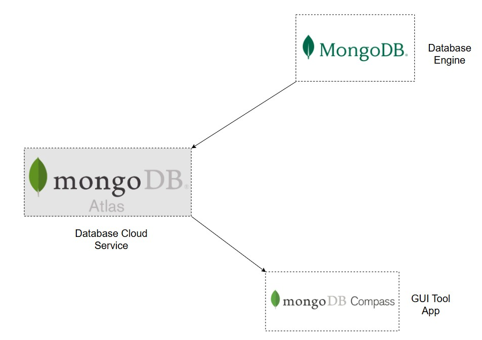

MongoDB - nền tảng lõi, Atlas triển khai cloud, Compass thao tác trực quan

16

---

3. Phân tích đề tài

  
3.2. Phần mềm

  

    

      <b>API VietQR</b> 
      - API chính thức tại <code>https://api.vietqr.io/v2/generate</code> 
      - Cho phép tạo mã QR thanh toán dựa trên thông tin tài khoản nhận tiền 
      - Yêu cầu chứng thực bằng <code>x-client-id</code> và <code>x-api-key</code> trong header 
      - Hỗ trợ nhiều ngân hàng nội địa qua mã BIN (acqId) 
      - Ứng dụng: tích hợp vào hệ thống robot giao hàng để khách thanh toán nhanh chóng
    

  

  

    

      <b>Các tham số chính trong Request</b> 
      - <code>accountNo</code>: Số tài khoản (6–19 ký tự) 
      - <code>accountName</code>: Tên tài khoản (5–50 ký tự, viết hoa, không dấu) 
      - <code>acqId</code>: Mã BIN ngân hàng (6 chữ số) 
      - <code>amount</code>: Số tiền (tối đa 13 ký tự) 
      - <code>addInfo</code>: Nội dung chuyển khoản (≤ 25 ký tự, không dấu) 
      - <code>format</code>: Định dạng trả về (text, image, dataURI) 
      - <code>template</code>: Mẫu QR (compact, compact2, qr_only, print)
    

  

  

    

      <b>Kết quả trả về</b> 
      - <code>qrCode</code>: Chuỗi dữ liệu QR 
      - <code>qrDataURL</code>: Ảnh QR dạng Data URI (có thể hiển thị trực tiếp) 
      - <code>accountName</code>, <code>accountNo</code>: Thông tin tài khoản nhận 
      - <code>amount</code>, <code>addInfo</code>: Thông tin giao dịch  
      <b>Lợi ích tích hợp</b> 
      - Giúp khách hàng thanh toán nhanh chóng, không nhập tay 
      - Giảm sai sót, tăng độ tin cậy 
      - Tích hợp trực tiếp vào ứng dụng giám sát robot giao hàng
    

  

  

    
    
Ảnh minh họa QR Code tạo bởi API VietQR

  

18

---

3. Phân tích đề tài

  

    
3.2. Phần mềm

  

    

      <b>Giao thức HTTP</b> 
      - HTTP (Hypertext Transfer Protocol) là giao thức truyền tải dữ liệu phổ biến trên Internet 
      - Hoạt động theo mô hình client - server: client gửi request, server trả về response 
      - Hỗ trợ truyền dữ liệu dạng text, hình ảnh, video, JSON 
      - Dễ dàng tích hợp với các thiết bị IoT nhờ tính đơn giản và phổ biến 
      - Được dùng làm nền tảng cho việc truyền dữ liệu video từ ESP32-CAM về máy tính hoặc thiết bị di động
    

  

  

  

    

      

        <b>Ứng dụng HTTP cho ESP32-CAM</b> 
        - ESP32-CAM có thể khởi tạo web server nội bộ 
        - Camera stream video trực tiếp qua HTTP, client chỉ cần truy cập địa chỉ IP 
        - Định dạng phản hồi: multipart/x-mixed-replace; boundary=frame 
        - Dữ liệu video được gửi dưới dạng MJPEG hoặc HTTP stream 
        - Tích hợp dễ dàng với ứng dụng giám sát xe: hiển thị video trên máy tính, điện thoại 
        - Ưu điểm: đơn giản, không cần phần mềm phức tạp, chỉ cần trình duyệt web 
        - Ứng dụng: giám sát hành trình xe, quan sát môi trường xung quanh robot
      

    

  

  

    
    
Giao thức HTTP

  

  

16

---

3. Phân tích đề tài

  

    
3.2. Phần mềm

  

    

      <b>Giao thức MQTT</b> 
      - MQTT (Message Queuing Telemetry Transport) là giao thức truyền thông nhẹ dành cho IoT 
      - Hoạt động theo mô hình publish - subscribe, giúp nhiều thiết bị trao đổi dữ liệu qua broker 
      - Tiêu tốn ít băng thông, phù hợp cho thiết bị nhỏ như ESP32 
      - Hỗ trợ truyền dữ liệu cảm biến, trạng thái thiết bị theo thời gian thực 
      - Được thiết kế để hoạt động ổn định ngay cả khi mạng không ổn định
    

  

  

  

    

      

        <b>Ứng dụng MQTT trong robot giao hàng</b> 
        - Dùng để gửi dữ liệu cảm biến từ xe về server giám sát 
        - Cho phép nhiều client (máy tính, điện thoại) cùng nhận dữ liệu từ robot 
        - Hỗ trợ điều khiển xe từ xa qua các topic riêng biệt 
        - Ưu điểm: nhẹ, nhanh, dễ mở rộng khi có nhiều robot cùng hoạt động 
        - Ứng dụng: giám sát trạng thái pin, tốc độ, hướng di chuyển, cảnh báo sự cố
      

    

  

    
    
Giao thức MQTT

  

  

17

---

3. Phân tích đề tài

  

    
3.2. Phần mềm

  

    

      <b>Giao thức ESP-NOW</b> 
      - ESP-NOW là giao thức truyền thông không dây nội bộ do Espressif phát triển 
      - Cho phép các thiết bị ESP32 giao tiếp trực tiếp với nhau mà không cần router Wi-Fi 
      - Dựa trên chuẩn Wi-Fi 802.11 nhưng nhẹ hơn nhiều so với TCP/IP 
      - Hỗ trợ truyền dữ liệu nhanh, độ trễ thấp, tiết kiệm năng lượng 
      - Phù hợp cho các ứng dụng IoT, robot, cảm biến phân tán
    

  

  

  

    

      

        <b>Ứng dụng ESP-NOW trong robot giao hàng</b> 
        - ESP32-CAM nhận lệnh điều khiển từ HiveMQ qua MQTT 
        - Sau đó gửi lệnh qua ESP-NOW đến ESP32-S3 để điều khiển động cơ 
        - ESP32-S3 có thể phản hồi trạng thái cảm biến ngược lại qua ESP-NOW 
        - Ưu điểm: không cần dây UART, không phụ thuộc mạng Wi-Fi 
        - Giúp hệ thống gọn nhẹ, linh hoạt, dễ triển khai trong môi trường thử nghiệm
      

    

  

  

    
    
Giao tiếp nội bộ giữa ESP32-CAM và ESP32-S3 bằng ESP-NOW

  

18

---

3. Phân tích đề tài

  

    
3.3. Phân tích hệ thống

  

    

      <b>Sơ đồ nguyên lý - sơ đồ mạch phần cứng</b> 
      - Hệ thống robot giao hàng được xây dựng từ các module chính: 
      + ESP32-S3: vi điều khiển trung tâm, nhận lệnh và điều khiển động cơ 
      + ESP32-CAM: camera giám sát, gateway nhận lệnh từ MQTT 
      + L298N: mạch cầu H điều khiển động cơ DC 
      + MPU6050: cảm biến gia tốc và con quay hồi chuyển 
      + LM2596: mạch hạ áp cấp nguồn ổn định 
      + Pin Li-ion 21V: nguồn chính cho toàn hệ thống 
      - Các kết nối chính: 
      + ESP32-S3 giao tiếp MPU6050 qua I2C 
      + ESP32-S3 xuất PWM điều khiển L298N - động cơ 
      + LM2596 hạ áp từ pin 21V xuống 5V/3.3V cấp cho ESP32 và cảm biến 
      + ESP32-CAM kết nối Wi-Fi để truyền video, đồng thời giao tiếp ESP32-S3 qua ESP-NOW 
    

  

  

  

    

      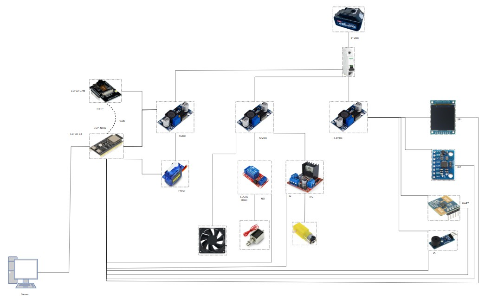
      
Sơ đồ nguyên lý mạch phần cứng robot giao hàng

    

  

19

---

3. Phân tích đề tài

  

    
3.3. Phân tích hệ thống

  

    

      <b>Use Case tổng quát</b> 
      - Hệ thống có 3 nhóm người dùng chính: 
      + <b>User</b>: đặt hàng, thanh toán, theo dõi trạng thái 
      + <b>Seller</b>: xác nhận đơn, quản lý sản phẩm 
      + <b>Admin</b>: giám sát hệ thống, theo dõi giao hàng 
      - Mỗi nhóm người dùng tương tác với hệ thống qua các chức năng riêng biệt 
      - Các chức năng được phân chia rõ ràng để đảm bảo bảo mật và hiệu quả vận hành
    

  

  

    

      <b>Use Case chi tiết</b> 
      - <b>User Functions</b>: 
      + Đặt hàng - lưu vào MongoDB 
      + Thanh toán bằng mã QR - gọi VietQR API 
      + Xem danh sách sản phẩm - từ Seller Portal 
      + Theo dõi trạng thái đơn - nhận từ Robot qua MQTT  
      - <b>Seller Functions</b>: 
      + Quản lý sản phẩm - thêm/xóa/sửa 
      + Xác nhận đơn - gửi trạng thái đến hệ thống  
      - <b>Admin Functions</b>: 
      + Giám sát giao hàng - nhận dữ liệu từ Robot 
      + Quản lý hệ thống - kiểm tra trạng thái các module
    

  

  

  

    

      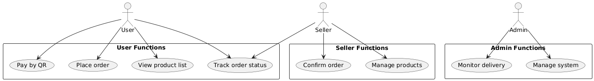
      
Sơ đồ Use Case tổng quát của hệ thống

  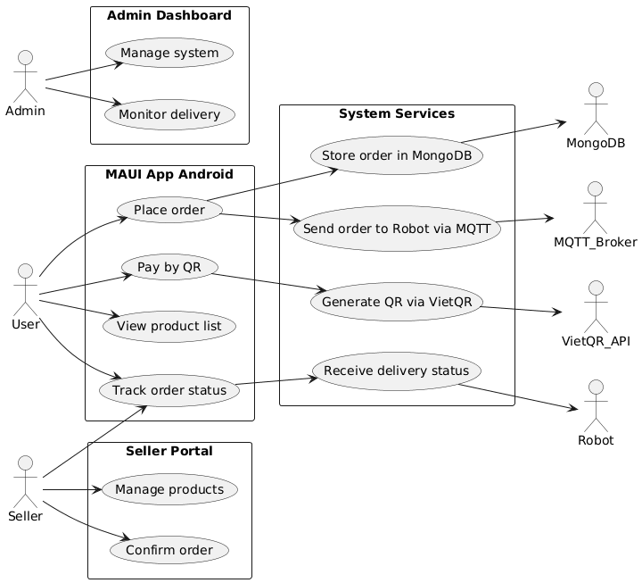
  
Sơ đồ kiến trúc hệ thống - luồng xử lý giữa các thành phần

  

  

20

---

3. Phân tích đề tài

  

    

      <b>Kiến trúc tầng trong MAUI App Android</b>
      
Ứng dụng MAUI Android được thiết kế theo mô hình nhiều lớp để dễ bảo trì và mở rộng.

  
<b>1. UI Layer - Giao diện người dùng:</b> gồm các thành phần chính như MainPage (trang chính), PaymentPage (thanh toán), và QrScanPage (quét mã QR).

  
<b>2. Service Layer - Xử lý nghiệp vụ:</b> bao gồm CommunicationService (giao tiếp với hệ thống), PaymentService (xử lý thanh toán), và MongoDbService (lưu trữ đơn hàng)

  
<b>3. Data Layer - Quản lý dữ liệu:</b> quản lý các mô hình dữ liệu như OrderModel (dữ liệu đơn hàng) và ProductModel (dữ liệu sản phẩm)./p>

  
<b>4. System Integration - Tích hợp hệ thống ngoài:</b> kết nối với các dịch vụ bên ngoài như MQTT Broker (gửi lệnh đến robot), VietQR API (tạo mã QR thanh toán), và MongoDB (lưu trữ dữ liệu đơn hàng).

  

      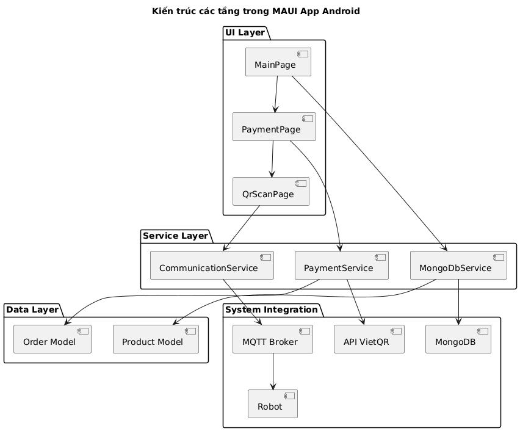
      
Kiến trúc các tầng trong MAUI App Android

21

---

3. Phân tích đề tài

  

    
3.3. Phân tích hệ thống

  

<b>Sơ đồ lớp (Class Diagram)</b>

  Sơ đồ lớp thể hiện các đối tượng chính trong hệ thống giao hàng và mối quan hệ giữa chúng. 
  Mỗi lớp đại diện cho một thực thể như người dùng, người bán, sản phẩm, và đơn hàng.

  <b>1. Lớp User:</b> chứa thông tin người dùng như user_id, username, password, email, và lịch sử đơn hàng.

  <b>2. Lớp Seller:</b> quản lý thông tin người bán gồm seller_id, tên cửa hàng, tài khoản, và danh sách sản phẩm.

  <b>3. Lớp Product:</b> mô tả sản phẩm với product_id, tên, mô tả, và giá.

  <b>4. Lớp Order:</b> lưu thông tin đơn hàng gồm order_id, user_id, product_id, seller_id, địa chỉ, trạng thái, và thời gian tạo.

  Các mối quan hệ giữa lớp: 
  • Một User có thể tạo nhiều Order 
  • Một Seller quản lý nhiều Product và xác nhận nhiều Order 
  • Một Order có thể chứa nhiều Product 
  • Mỗi Product thuộc về một Seller

  

    

      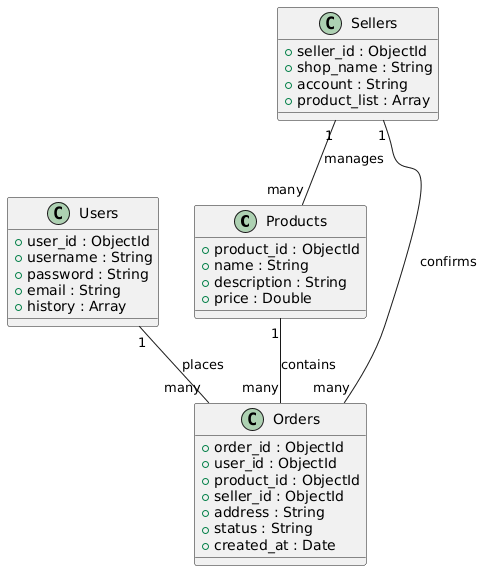
      
Sơ đồ lớp hệ thống giao hàng

    

  

22

---

3. Phân tích đề tài

3.3. Phân tích hệ thống

  <b>Sơ đồ trình tự (Sequence Diagram)</b>
  

    Sơ đồ trình tự mô tả luồng xử lý đơn hàng từ lúc người dùng chọn sản phẩm đến khi robot nhận lệnh giao hàng. 
    Các thành phần tham gia gồm: User, MAUI App Android, MongoDB, API VietQR, MQTT/HTTP Broker và Robot.
  

  

    <b>Quy trình xử lý:</b> 
    1. User chọn sản phẩm và xác nhận đơn hàng trên MAUI App 
    2. MAUI App lưu thông tin đơn hàng vào MongoDB 
    3. MAUI App gọi API VietQR để tạo mã QR thanh toán 
    4. User quét mã QR trên QrScanPage 
    5. MAUI App xác thực kết quả thanh toán với API VietQR 
    6. API VietQR trả về trạng thái thanh toán 
    7. MAUI App cập nhật trạng thái đơn hàng trong MongoDB 
    8. MAUI App gửi thông tin đơn hàng đến Robot qua MQTT/HTTP Broker 
    9. Broker truyền dữ liệu đơn hàng đến Robot 
    10. MAUI App phản hồi trạng thái giao hàng cho User
  

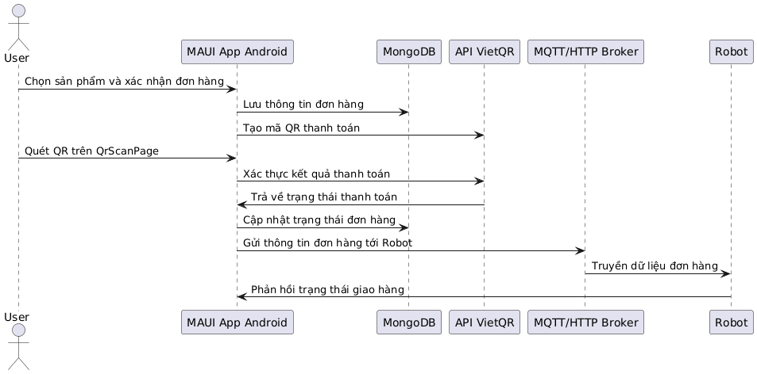

Sơ đồ trình tự xử lý đơn hàng và giao hàng

23

---

4. Quá trình thực nghiệm

4.1. Thực nghiệm phần cứng

<b>Quá trình lắp ráp thiết bị</b> 
- Các module phần cứng được kết nối theo sơ đồ nguyên lý đã thiết kế 
- ESP32-S3 được gắn vào khung xe, kết nối với L298N để điều khiển động cơ 
- ESP32-CAM được cố định phía trước xe để giám sát hành trình 
- Cảm biến MPU6050 được đặt gần tâm xe để đo góc nghiêng và hướng quay 
- Module LM2596 hạ áp từ pin 21V xuống 5V và 3.3V cấp cho các thiết bị 
- Servo SG90 được gắn vào cơ cấu mở hộp hàng 
- Các dây nguồn, tín hiệu được hàn và cố định bằng keo nhiệt để đảm bảo chắc chắn

<b>Kiểm tra kết nối</b> 
- Sau khi lắp ráp, tiến hành kiểm tra từng module bằng nguồn thử 
- Đảm bảo các chân GPIO, nguồn cấp và tín hiệu điều khiển hoạt động đúng 
- Kiểm tra khả năng quay động cơ, phản hồi cảm biến, truyền dữ liệu camera 
- Ghi nhận các lỗi kết nối và khắc phục trước khi chạy thử toàn hệ thống

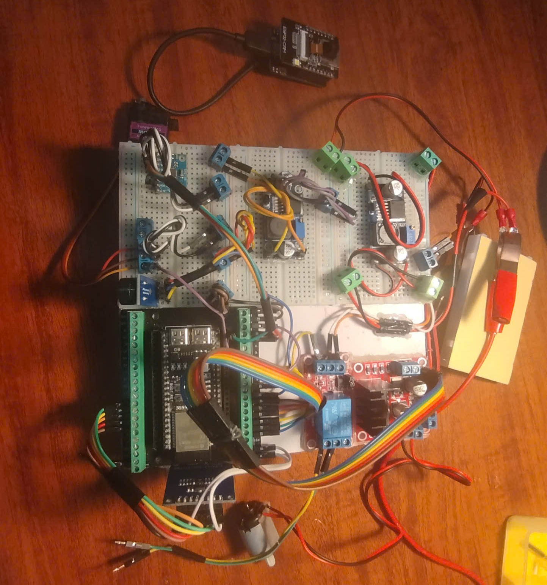

Hình ảnh thực tế quá trình lắp ráp thiết bị phần cứng

18

---

4. Quá trình thực nghiệm

4.1. Thực nghiệm phần cứng

<b>Mô hình xe thử nghiệm (MVP)</b> 
- Xe được lắp ráp từ các module phần cứng đã phân tích 
- Khung xe đơn giản, tập trung vào chức năng hơn thẩm mỹ 
- Có gắn thanh khe tản nhiệt ở đáy để tránh nước mưa từ trên nóc chảy xuống 
- Các linh kiện (ESP32-S3, ESP32-CAM, L298N, MPU6050, LM2596, pin 21V, động cơ, servo) được bố trí theo sơ đồ nguyên lý 
- Dây điện và module được cố định bằng keo nhiệt và khung nhựa 
- Mục tiêu: kiểm chứng khả năng vận hành, không đặt nặng hình thức

<b>Ý nghĩa thực nghiệm</b> 
- Dù mô hình chưa đẹp, nhưng phản ánh tư duy giải quyết vấn đề thực tế 
- Chống nước, chống rung, đảm bảo an toàn cho mạch điện 
- Là bước quan trọng để kiểm tra tính khả thi trước khi phát triển phiên bản hoàn thiện

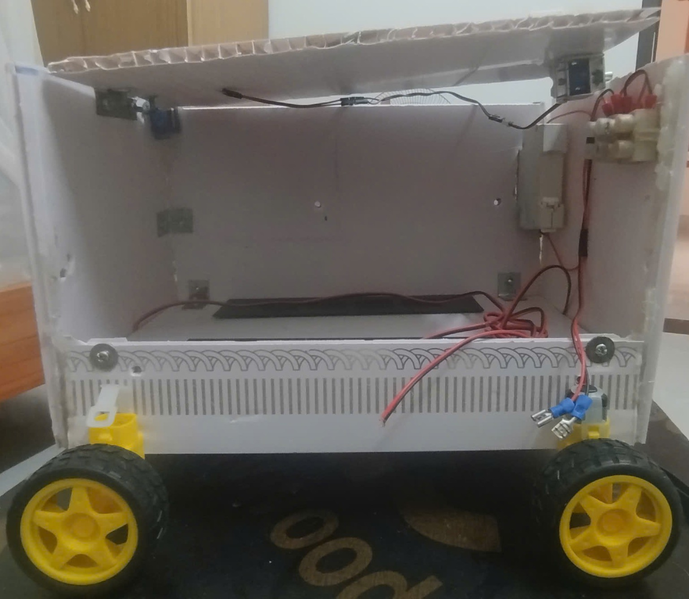

Mô hình xe thử nghiệm (MVP) – tập trung vào chức năng

19

---

4. Quá trình thực nghiệm

4.1. Thực nghiệm phần cứng

<b>Thách thức và điều chỉnh thiết kế</b> 
- Ban đầu định hướng dùng nhiều module nhưng phải bỏ bớt khi thực nghiệm 
- Bỏ module <b>A7680C</b> (4G) vì phức tạp, không cần thiết cho thử nghiệm 
- Bỏ driver <b>BTS7960</b> vì quá tải, thay bằng L298N đơn giản hơn 
- Bỏ động cơ 12V DC, chỉ dùng động cơ DC mini phù hợp tải nhẹ 
- MPU6050 chỉ dùng bản 3 trục thay vì 9 trục để giảm chi phí 
- Không dùng mạch PCB lỗ, thay bằng breadboard để test nhanh, sau đó cố định bằng keo nóng 
- Dùng dây điện AWG 14 để đảm bảo tải dòng cho motor 
- Chia nguồn riêng cho L298N (động cơ) và nguồn điều khiển (ESP32, cảm biến)

<b>Bài học rút ra</b> 
- Luôn cần linh hoạt, sẵn sàng thay đổi thiết kế khi gặp vấn đề thực tế 
- Ưu tiên tính khả thi và ổn định hơn là hình thức 
- Thử nghiệm nhanh bằng breadboard và keo nóng giúp tiết kiệm thời gian 
- Việc chọn dây điện, chia nguồn đúng cách là yếu tố quan trọng để tránh hỏng mạch

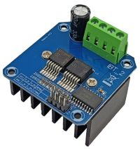

Module BTS7960 – driver công suất cao, đã bỏ trong quá trình thử nghiệm

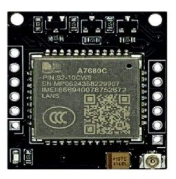

Module A7680C – modem 4G, không dùng trong phiên bản thử nghiệm

21

---

4. Quá trình thực nghiệm

4.2. Thực nghiệm phần mềm

<b>Giao diện MAUI App viết bằng C#</b> 
- Ứng dụng được xây dựng bằng .NET MAUI, ngôn ngữ C# 
- Chạy trên Android, giao tiếp với robot qua HTTP và MQTT 
- Giao diện đơn giản, dễ thao tác, phù hợp cho thử nghiệm

<b>Các màn hình chính</b> 
- <b>Trang chủ:</b> hiển thị danh sách sản phẩm, đơn hàng, nút thanh toán 
- <b>Chi tiết đơn hàng:</b> hiển thị mã đơn, tên sản phẩm, giá tiền 
- <b>Quét QR:</b> dùng camera để quét mã đơn hàng 
- <b>Giám sát robot:</b> hiển thị trạng thái robot, video từ ESP32-CAM 
- <b>Cài đặt:</b> cấu hình địa chỉ MQTT, HTTP, thông tin người dùng

<b>Ý nghĩa</b> 
- Giao diện giúp người dùng thao tác nhanh, trực quan 
- Là cầu nối giữa người dùng và hệ thống robot 
- Dễ mở rộng thêm chức năng như theo dõi vị trí, trạng thái pin, cảnh báo

Giao diện MAUI App Android – màn hình danh sách sản phẩm và đơn hàng

22

---

4. Quá trình thực nghiệm

4.2. Thực nghiệm phần mềm

<b>Tính năng thanh toán QR</b> 
- Ứng dụng MAUI App tích hợp API VietQR Sandbox để tạo mã QR thanh toán 
- Mỗi đơn hàng có mã riêng (ví dụ: DH_003, DH_004...) 
- Khi người dùng nhấn “Thanh toán”, app gửi yêu cầu tạo QR đến VietQR 
- QR hiển thị thông tin người nhận, số tiền, nội dung chuyển khoản chứa mã đơn hàng

<b>Demo xác nhận thanh toán</b> 
- Sau khi người dùng quét QR và chuyển khoản, hệ thống kiểm tra giao dịch 
- So sánh nội dung chuyển khoản với mã đơn hàng (ví dụ: “DH_003”) 
- Nếu trùng khớp, đơn hàng được đánh dấu là “Đã thanh toán” 
- Quá trình xác nhận được thực hiện qua API kiểm tra lịch sử giao dịch (mock từ VietQR Sandbox)

<b>Ý nghĩa</b> 
- Giúp người dùng thanh toán nhanh chóng, không cần nhập tay 
- Tăng độ tin cậy và tự động hóa quy trình xác nhận đơn hàng 
- Là bước thử nghiệm quan trọng để tích hợp thanh toán thật trong tương lai

Giao diện MAUI App – danh sách sản phẩm và nút thanh toán QR

23

---

4. Quét đơn hàng thành công

  

    
Minh chứng xác nhận thanh toán

    

      

        Sau khi khách hàng quét mã QR và thanh toán thành công, hệ thống hiển thị xác nhận đơn hàng đã được thanh toán. Cơ cấu mở hatch hàng được kích hoạt tự động.
      

    

  
Thông điệp hiển thị

  

    

      "Order DH_003 confirmed as paid! 
      Cargo hatch OPENED"
    

  

  
Ý nghĩa

  

    

      Hệ thống tích hợp giữa phần mềm xác nhận giao dịch và phần cứng điều khiển hatch giúp đảm bảo quy trình giao hàng tự động, an toàn và chính xác.
    

  

  

  

    

      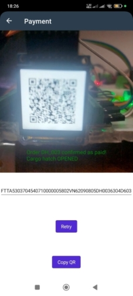
      
Màn hình xác nhận đơn hàng DH_003 đã thanh toán thành công

    

  

19

---
